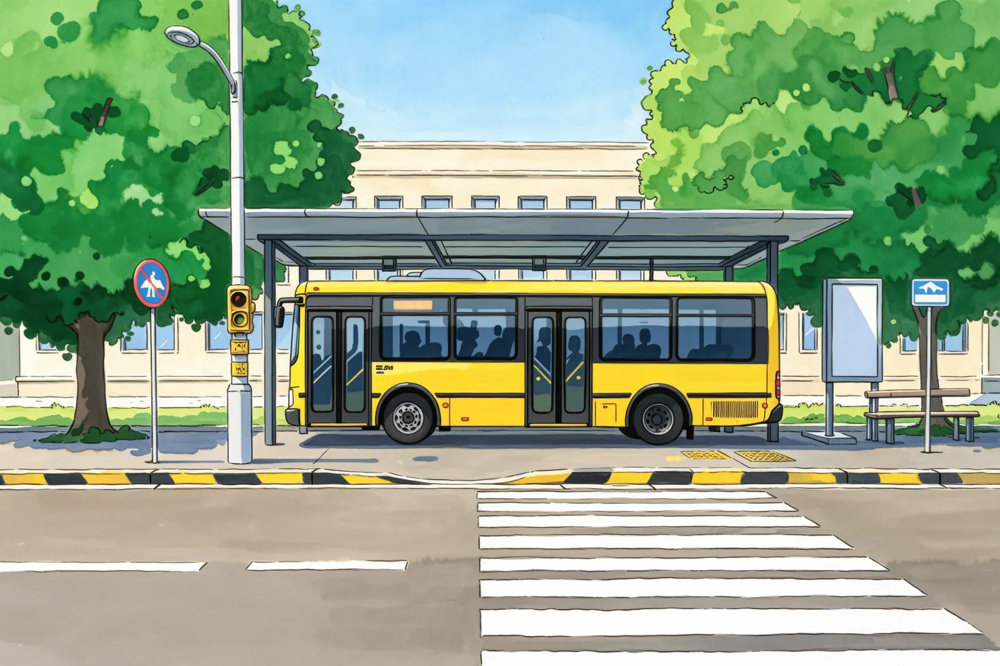
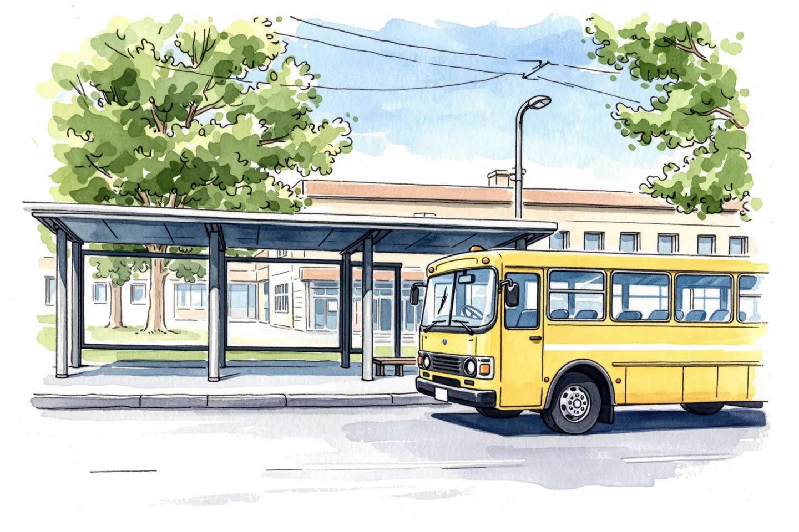
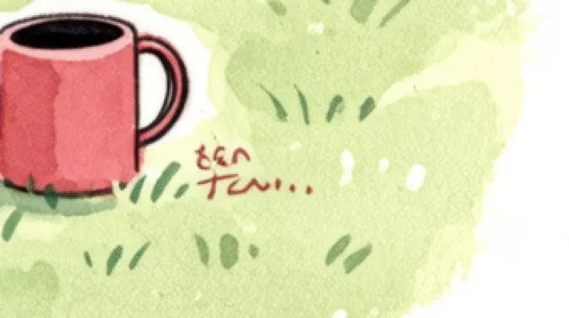

# 课程卡片改版 + AI 主题封面 — 设计文档

- 日期：2026-09-29
- 状态：待评审
- 范围：课程广场 / 我的课程 / 教材同步 三个列表页的卡片，以及课程详情页封面

---

## 1. 背景与问题

### 1.1 用户视角

课程卡片现在「都没有封面，只有一个颜色」。核实后，真实情况比这更糟 —— 是**三种状态混排**：

| 状态 | 行数 | 表现 |
| --- | --- | --- |
| `cover_url` 为空 | 580 | 落到分类渐变色块（**全部 580 行都是在架课程**） |
| `cover_url` 是 `picsum.photos` 随机图 | 195 | 随机风景照，与课程主题无关，且挂在第三方外链（其中在架 194 门） |
| 真正贴合主题的图 | **0** | —— |

生产库 `courses` 表共 775 行，其中在架 774 门（`is_published = 1`）。
本文后续凡涉及「774 门」均指在架课程，「195 行」指含未上架那一行在内的表级计数。

### 1.2 代码视角

- `courses.cover_url`（`mediumtext`）与「无图时渐变兜底」**早已实现**，所以本任务不是新增字段，而是补图 + 改版。
- `CourseCard.tsx` 把**课程标题渲染了两遍**：封面上一次（第 119-124 行）、信息区再一次（第 140 行）。色块时代这是「海报感」设计，换成真图后是纯粹的重复。
- `CATEGORY_THEMES` / `DEFAULT_THEME` / `getTheme()` 在 `CourseCard.tsx` 与 `CourseDetailClient.tsx` 里**各复制了一份**，约 40 行。
- 卡片信息区只有「来源 + 人数」，而 `learner_count` 在 774 门课里**大量为 0**，等于这一行常常是空的。
- 广场最多 5 列，xl 断点下卡片实际宽约 **220px** —— 所有版式判断必须按这个真实尺寸做。
- 两处封面都用裸 ``，未走 `next/image`。

### 1.3 一个必须一并修的既有 bug

`src/app/api/courses/list/route.ts:31` 把 `pageSize` 夹到上限 100：

```ts
const pageSize = Math.min(100, Math.max(1, toInt(searchParams.get("pageSize"), 20)))
```

而 `MyCoursesClient.tsx:38` 请求的是 `pageSize=500`，然后**在前端筛出「我的课程」**。这个组合的前提是「能拿到全部课程」，但实际只能拿到按 `created_at` 倒序的最新 100 门。

生产库实测：

- 774 门在架课程中，**674 门（87%）** 对「我的课程」不可见（截断点 `created_at = 2026-06-15 15:20:35`）。
- `user_course_progress` 中有 **24 行**指向被挡住的课程，涉及 **15 / 26 个用户（58%）**，其中 13 个真实微信用户。
- `user_acquired_courses` 暂无被挡记录（该表只有 1 行），所以这条路径尚未爆出。

这不是潜在风险，是**已经发生**的用户可用性问题。而「我的课程」正是本次要加进度条的那个页面 —— 不修它，加进度条的价值会被这个 bug 吃掉。

---

## 2. 目标与非目标

### 目标

1. 774 门在架课程**全部**有贴合主题的封面，且不依赖任何第三方外链。
2. 课程卡片改版：区分「发现课程」与「继续学习」两种使用场景。
3. 顺带修掉 1.3 的 `pageSize` bug。
4. 收拢 1.2 中的重复代码。

### 非目标

- 不做用户上传封面的自助入口（后台已有）。
- 不做视频/动图封面。
- 不重构课程详情页的其余部分。
- 不新增数据库列、不做数据库迁移。

---

## 3. 已拍板的决策（含被否决方案与理由）

| # | 决策 | 被否决的方案与理由 |
| --- | --- | --- |
| D1 | 封面图用**阿里云百炼通义万相** `wan2.2-t2i-flash` 生成 | 账号免费额度里只有 `qwen-image-3.0` / `-pro` 共 20 张可用于文生图（视频模型和 `qwen-mt-image-2.0` 图片翻译模型用不上），不够 69 张；且风格决策全部基于 flash 的真实输出，换模型会让风格依据作废 |
| D2 | **统一用 flash**，不使用免费额度、不混模型 | 混模型会破坏视觉一致性 —— 风格一致性 > 省 6 元 |
| D3 | 粒度 = 44 张「主题基图」+ 约 20~30 张主推课专属图 | 逐门生成 775 张：风格必然不统一，775 张无人能逐张审核，且新增课程还要再调 API |
| D4 | **`cover_url` 降级为「覆盖项」，主题映射表放代码里** | 把 44 条路径写进 775 行 `cover_url`：需要批量 UPDATE 与手工迁移，新增课程不会自动有图，换主题图要改几十行数据 |
| D5 | 图片提交进仓库 `public/images/courses/` | 阿里云 OSS：要新建 bucket、配域名与密钥、多一层故障面；而 `deploy.sh` 的 `git pull --ff-only` 已经能自动带上仓库内文件 |
| D6 | 卡片改版采用**双形态**（`discover` / `mine`） | 单形态：广场是「在挑课程」，我的课程是「回来继续练」，两者共用一张卡则两边都不最优 |
| D7 | 广场态**放弃把标题压在图上**，改为图下标题 | 压图方案：4 张真实样图的底部**全部**是画面里最亮最碎的座椅区，「下三分之一保持简洁偏暗」这条约束一次都没生效 |
| D8 | 风格按大类分流：`graded_reading` + `school_sync` 用水彩，其余用扁平 | 单一风格：243 门儿童/校园课与 531 门应试/职场课对温度与严肃度的要求相反 |
| D9 | 一并修 `pageSize` bug，新增 `/api/courses/mine` | 只提高 pageSize 上限：本质仍是「全量拉到浏览器再前端筛」，课程库增长后必再撞墙；且后台「上传封面」是把 base64 dataURL 写进 `cover_url`（`mediumtext`），一旦有人用后台传图，全量拉取立刻变成 MB 级载荷炸弹 |

---

## 4. 架构

### 4.1 封面解析：三层降级

新增 `src/lib/course-cover.ts`，导出：

```ts
/** 分类配色（从 CourseCard.tsx 与 CourseDetailClient.tsx 收拢，消除重复） */
export const CATEGORY_THEMES: Record<string, CategoryTheme>
export const DEFAULT_THEME: CategoryTheme
export function getTheme(categoryKey: string | null): CategoryTheme

/** 44 条主题槽位 → WebP 路径 */
export const THEME_COVERS: Record<string, string>

/** 三层降级 */
export function resolveCourseCover(course: {
  coverUrl: string | null
  categoryKey: string | null
  subCategoryKey: string | null
}): { kind: "image"; src: string; theme: CategoryTheme }
  | { kind: "gradient"; theme: CategoryTheme }
```

解析顺序：

1. `course.coverUrl` 非空 → 用它（主推课专属图 / 管理员上传 / 版权方提供）
2. 主题映射表命中 `(categoryKey, subCategoryKey)` → `/images/courses/<slug>.webp`
3. 都没命中 → 分类渐变兜底

**三层降级，永不出现空白封面。**

槽位命名：

```
slug = `${categoryKey ?? "none"}__${subCategoryKey ?? "general"}`
例：practical__movies_stories.webp
    school_sync__general.webp      （sub_category_key 为 NULL）
    none__general.webp             （两个都为 NULL）
```

### 4.2 调用方

`CourseCard` 与 `CourseDetailClient` **都是客户端组件，且都已持有完整 course 对象**（`/api/courses/list` 与 `/api/courses/[id]` 均 `db.select()` 返回全部列）。

因此：

- **不需要改任何 API 路由的参数或返回结构**（除 6.1 新增的 `/api/courses/mine`）；
- 不需要改 `src/types/course.ts` 的 `Course`；
- **不需要数据库迁移**。

`/api/courses/[id]` 已确认返回完整行（`route.ts:11` `db.select().from(courses)`，第 16 行 `data: course`）。

### 4.3 主题槽位清单（生产库实测，共 44 个）

**扁平 — 24 个槽位 / 531 门**

| category | sub_category | 课程数 |
| --- | --- | --- |
| practical | movies_stories | 71 |
| practical | classic_textbooks | 49 |
| practical | grammar_vocab | 48 |
| practical | listening_speaking | 45 |
| exam_prep | ielts_toefl | 34 |
| practical | daily_oral | 32 |
| practical | _(NULL)_ | 30 |
| _(NULL)_ | _(NULL)_ | 28 |
| exam_prep | cet_4_6 | 25 |
| practical | business_career | 20 |
| exam_prep | pte | 20 |
| exam_prep | gaokao | 19 |
| exam_prep | zhuan_sheng_ben | 19 |
| exam_prep | zhongkao | 15 |
| exam_prep | postgraduate | 14 |
| practical | travel_english | 11 |
| exam_prep | degree_english | 9 |
| exam_prep | tem_4_8 | 8 |
| exam_prep | pet | 8 |
| exam_prep | gre | 6 |
| exam_prep | toeic | 6 |
| exam_prep | ket | 6 |
| exam_prep | fce | 5 |
| exam_prep | _(NULL)_ | 3 |

**水彩 — 20 个槽位 / 243 门**

| category | sub_category | 课程数 |
| --- | --- | --- |
| school_sync | grade_4 | 32 |
| school_sync | grade_3 | 26 |
| school_sync | grade_8 | 24 |
| school_sync | grade_1 | 19 |
| school_sync | grade_7 | 18 |
| school_sync | grade_5 | 17 |
| school_sync | grade_6 | 11 |
| school_sync | _(NULL)_ | 11 |
| school_sync | high_school | 10 |
| school_sync | grade_9 | 10 |
| school_sync | grade_2 | 9 |
| graded_reading | oxford_reading_tree | 7 |
| graded_reading | lets_go | 7 |
| graded_reading | raz | 7 |
| graded_reading | heinemann | 7 |
| school_sync | vocational | 7 |
| graded_reading | big_cat | 6 |
| graded_reading | oxford_bookworm | 6 |
| graded_reading | red_rocket | 5 |
| graded_reading | _(NULL)_ | 4 |

24 + 20 = 44 个槽位，531 + 243 = 774 门课，与 `is_published = 1` 的总数一致。

---

## 5. 生成流水线

### 5.1 脚本 `scripts/gen-course-covers.ts`

分步执行、每步幂等，支持 `--step=generate|compress|report` 与 `--force`：

| 步骤 | 行为 | 幂等规则 |
| --- | --- | --- |
| generate | 串行调 API，44 条主题提示词（按 D8 分流风格） | 目标 PNG 已存在且未 `--force` → 跳过 |
| compress | sharp 转 WebP，写 `public/images/courses/` | 同上 |
| report | 打印成功率、总体积、失败清单 | —— |

中间产物 PNG 落 `.covers-build/`（加进 `.gitignore`），**只有 WebP 进仓库**。

### 5.2 接口约束（全部为实测所得，不是文档抄来的）

| 项 | 值 | 为什么 |
| --- | --- | --- |
| 创建任务 | `POST /api/v1/services/aigc/text2image/image-synthesis`，带 `X-DashScope-Async: enable` | 异步两步式 |
| 查询结果 | `GET /api/v1/tasks/{task_id}` | 轮询至 `SUCCEEDED` |
| `model` | `wan2.2-t2i-flash` | D1/D2 |
| `size` | `1440*960`（3:2） | flash **限制宽高都在 [512, 1440]**；3:2 一张原图供两种卡片形态 `object-cover` 共用 |
| `n` | **必须显式写 1** | 官方默认是 **4**，不写就是一次 4 张、4 倍计费 |
| `prompt_extend` | **必须显式写 false** | 默认 true 会让大模型改写提示词，44 张各改各的 → 风格漂移 |
| `watermark` | 显式写 false | 默认为 false，显式钉住防误改 |
| `negative_prompt` | 放在 `input` 内（**不是** `parameters`） | 见官方示例 |
| 并发 | **串行 + 429 退避重试** | 实测 3 并发即触发 `Throttling.RateQuota`，账号实际并发配额低于文档的 120 RPM |
| 结果 URL | 有效期仅 **24 小时** | 必须下载后落盘，**不能存链接** |
| 提示词 | **禁止出现任何 IP 名 / 作品名 / 明星名** | 官方文档明确：提示词含受版权保护的角色名或作品名会触发 `IPInfringementSuspect` / `DataInspectionFailed`，关闭 `prompt_extend` 也无法绕过。而课程库大量是《Journey to the West》《老友记》《Sherlock Holmes》这类 —— 因此提示词只能描述**场景与氛围**，不能描述招牌形象 |
| 图片转码 | sharp 通过 `createRequire(require.resolve('next/package.json'))` 解析 | `sharp@0.34.5` 已是 `next` 的可选依赖，pnpm 未提升到顶层；**不新增任何依赖** |
| WebP 质量 | q80，`effort: 5` | 实测 827KB PNG → 54KB；44 张约 2.4~5.4MB |

### 5.3 提示词结构（v3，已通过实测验证）

```
[风格 + 配色前置]。[画面主体：短场景]。[构图]。[风格与配色再钉一次]。
negative_prompt: [通用负向词] + [按风格各配一份]
```

**v3 相对 v1 的三处关键改动（每一处都有实测依据）：**

1. **风格词前置**，而不是放在整段末尾。
   依据：v1 把风格后缀放在末尾时，水彩漂成动漫背景、扁平漂成描线 CG —— 模型被前面一长串具体名词主导，把结尾的风格词当成了弱约束。
2. **配色必须写进风格约束**。
   依据：v2 只钉住了画法，没钉住色板，于是「会议室」场景让整张塌成冷调单色，而同为扁平的「书桌」场景是暖色编辑插画。v3 显式写入色板后（扁平 = 深蓝灰底 + 砖红暖橙强调色）配色收敛。
3. **按风格各配一份负向词**，把「另一种画法」明确排掉。

#### 证据图

风格分化（第一批：同一主题、同一段提示词、只换风格后缀）：

| 扁平（选定用于应试/职场 531 门） | 水彩（选定用于儿童/校园 243 门） |
| --- | --- |
|  |  |

风格漂移与修复（水彩，同一场景）：

| v1 漂成动漫背景 + 车身站牌出现乱码汉字 | v2 修复：纸纹与墨线回归，乱码消失 |
| --- | --- |
|  |  |

配色漂移与修复（扁平，同一场景）：

| v1 漂成描线 CG | v2 画法修好但配色塌成冷调单色 | v3 钉住色板后收敛 |
| --- | --- | --- |
|  |  |  |

目前已达到的最佳效果（扁平 · 应试考试）：


风格定义（`STYLE` 常量）：

- **水彩**：`水彩手绘风格，湿画法水彩晕染，明显的粗纹水彩纸质感，淡雅的莫兰迪配色，笔触松弛，温暖治愈的儿童绘本插画质感` + 配色 `莫兰迪暖调：主色草木绿与米黄，暖砖红与淡粉点缀，少量天蓝`
- **扁平**：`扁平矢量插画风格，克制的几何形状，大面积纯色块，边缘干净利落，无描边、无渐变、无噪点，现代教育科技产品的编辑插画质感` + 配色 `深蓝灰底（近似 #1e293b）、砖红暖橙为唯一强调色（近似 #e2603f）、点缀米白`

共用构图约束：`画面中心构图，主体四周留出余量，重要元素不贴近画面边缘，画面中没有人`
（**刻意不含**「下三分之一留暗区」—— 已决定标题不压图，见 D7）

通用负向词要点：文字类词写得冗余（`文字, 汉字, 英文字母, 单词, 标题, 字幕, 招牌, 站牌, 指示牌, 广告牌, 标语 ...`），并含 `画面中没有人` 配套的 `面部特写, 人群, 多余手指, 畸形`。

### 5.4 已知风险与人工把关

**落款问题（未解决，转人工）**

水彩风格会在画面内生成**手写体画师落款式伪文字**。两轮负向词均无效：

- v1/v2：`签名, 印章` → 出现在右下角
- v3：追加 `手写签名, 落款, 作者署名, 花体字, 草书, 手写字, 装饰性文字, 角落文字, 版权声明` → **仍然出现，只是被挪到画面内部并改变颜色以融入画面**

结论：水彩插画的训练数据里画师署名是普遍特征，模型把它视为「像水彩」的一部分。**停止在提示词上继续投入**（边际收益已归零）。

证据（v3 中落款被挪到画面内部、并改为红褐色以融入画面）：



把关方式：水彩只有 20 张，**量产后人工逐张过目**，发现落款的单张重跑（0.14 元/张）。扁平 4 张样本中 0 张出现落款，可直接量产。

**白纸边（已决定接受）**

水彩的「孤景构图」（主体浮在纸上、周围留白）会形成白纸边，在深色 UI 里形成亮边。
实测：**满幅构图（如公交站）没有白边，孤景构图（如花园小狗）有**。故这不是水彩的普遍属性，而是场景构图相关。
「水彩颜料铺满整幅画面、不留白边」这句提示词实测**无效**（反而白边更大）。
不保证压缩环节的中心裁切能解决（该图白边深入约 65px，需放大至约 1.16 倍才裁得掉，已超出「轻微裁切」范围）。
**决定：接受。** 若量产评审时认为不可接受，作为独立问题另行处理。

---

## 6. 卡片改版

### 6.1 数据源：新增 `GET /api/courses/mine`

```
1. 取 user_acquired_courses ∪ user_course_progress 的 courseId 集合（当前用户）
2. JOIN courses，条件：is_published = 1 且未被软删除（aliveCourse）
3. 同时算出每门课的 stats
4. 按 lastStudiedAt 倒序（无进度记录的排在后面）
```

返回值：课程行 + `{ lessonCount, sentenceCount, completedLessons }`。

**进度口径**：`completedLessons / lessonCount`，其中 `completedLessons` 来自

```sql
SELECT COUNT(*) FROM practice_sessions
WHERE user_id = ? AND course_id = ? AND state = 'completed'
```

`practice_sessions` 有 `UNIQUE (user_id, lesson_id)`，保证一课一行，计数精确。

**刻意不用 `user_course_progress.sentenceCount` 做百分比** —— `CLAUDE.md` 已记录它是单调递增的历史累计值（重练会持续增长），拿它当分子会出现 >100% 的进度条。

同时去掉「全量拉课程再前端筛」这个浪费（每行还带着 `description` 与 `mediumtext` 的 `cover_url`）。

### 6.2 组件接口

```ts
interface CourseCardStats {
  lessonCount: number
  sentenceCount: number
  completedLessons: number
}

interface CourseCardProps {
  course: Course
  /** 默认 "discover" —— 广场与教材同步行为不变 */
  variant?: "discover" | "mine"
  /** 仅 variant="mine" 需要，由 /api/courses/mine 提供 */
  stats?: CourseCardStats
}
```

- **`discover`**（课程广场 / 教材同步）：3:2 大图 + **图下**标题（`line-clamp-2`）+ 一行「分类 · N 人在学」
- **`mine`**（我的课程）：16:10 图 + 标题 + 「N 课 · M 句」+ 进度条 + 悬停浮现「继续学习」

`variant` 默认值为 `"discover"`，因此三个列表页中只有 `/home/courses` 需要传 `"mine"`，另外两个无需改动。

### 6.3 其他改动

- 两处裸 `` 改 `next/image`，并给 `sizes` 按 1/2/3/4/5 列断点声明，避免 20 张原图同时下载。
- 删除 `CourseCard.tsx` 与 `CourseDetailClient.tsx` 中各自复制的 `CATEGORY_THEMES` / `DEFAULT_THEME` / `getTheme`（各约 40 行）。
- 消除标题重复渲染：`discover` 与 `mine` 都只在图下渲染一次标题。

---

## 7. 数据清理

那 195 行 `picsum` 是随机照片、与主题无关、且挂第三方外链，必须清掉：

```sql
-- 执行前先 mysqldump 备份 courses 表
UPDATE courses SET cover_url = NULL WHERE cover_url LIKE '%picsum%';
```

受影响 **195 行**（在架 194 门 + 未上架 1 门）。

置空后这 194 门在架课程**自动落到第 2 层**（主题映射表），与其余 580 门走完全相同的路径 —— 没有特殊情况，也没有一门课会失去封面。

> **这是一次对生产库的写操作，且生产库就是唯一的库（无 staging）。**
> 必须在执行前完成备份、打印确切的受影响行数、并由人工明确确认后才执行。

---

## 8. 测试与验收

### 8.1 单元测试（`vitest`，node 环境）

`resolveCourseCover` 是纯函数，可测。用例：

1. `coverUrl` 非空 → `kind === "image"`，且 `src === coverUrl`（覆盖项优先于映射表）
2. `coverUrl` 为空 + 槽位命中 → `kind === "image"`，`src` 指向 `/images/courses/<slug>.webp`
3. `coverUrl` 为空 + 槽位未命中 → `kind === "gradient"`
4. `categoryKey` / `subCategoryKey` 为 `null` → slug 分别退化为 `none` / `general`
5. `THEME_COVERS` 的每个值都指向 `public/` 下真实存在的文件（防「映射表指向不存在的图」这类静默错误）

第 5 条尤其重要：它把「44 条映射」与「44 个实际文件」绑在一起，避免漏生成某一张时只表现为「那几门课悄悄退回渐变」。

### 8.2 浏览器验证（puppeteer 脚本，见 `CLAUDE.md`）

`vitest` 未启用 jsdom，React 组件无法单测，故用 `/tmp` 下的 puppeteer 脚本跑真实页面：

- 三个列表页各有封面渲染，且无 404 图片请求（监听网络失败）
- `mine` 形态显示进度条，`discover` 形态不显示
- 220px 卡片尺寸下标题不溢出、不截断成半个字
- 深色 / 浅色两种主题下标题与元信息的对比度可读

### 8.3 数据验收

- `SELECT COUNT(*) FROM courses WHERE is_published=1 AND (cover_url IS NULL OR cover_url='')` → 预期 774（picsum 清空后）
  > 实际执行结果：774 ✓（2026-09-29）
- 逐门课调用 `resolveCourseCover`，断言 **没有任何一门课落到第 3 层渐变兜底**（当前 44 个槽位覆盖全部 774 门，这是可以断言的强条件）

  > 已在生产库核实：按 44 个 `(category_key, sub_category_key)` 槽位分组，**未覆盖课程数 = 0**。所以这条断言现在是成立的，且它会在未来新增课程落入新槽位时立刻失败 —— 这正是我们想要的提醒。

### 8.4 `pageSize` bug 的验收

修复前后对比同一批用户的「我的课程」数量：

- 修复前：`progress_outside_cap = 24`（15 个用户受影响）
- 修复后：预期 `0`，且这 15 个用户的列表条数增加

---

## 9. 回滚

| 部分 | 回滚方式 |
| --- | --- |
| 卡片改版 | `git revert`；`variant` 默认值的引入使三个列表页在回滚前后行为一致 |
| 封面映射 | `resolveCourseCover` 的第 2 层命中失败即自动退回渐变，**删掉 `THEME_COVERS` 或图片文件即可整体失效**，不会白屏 |
| `/api/courses/mine` | 新路由，回滚时删除即可；`MyCoursesClient` 可临时切回旧逻辑 |
| picsum 清空 | **不可逆**（置 NULL 后原 URL 丢失），靠执行前的 `mysqldump` 备份恢复 |

---

## 10. 交付物

1. `src/lib/course-cover.ts`（新增）
2. `src/lib/__tests__/course-cover.test.ts`（新增）
3. `src/components/home/store/CourseCard.tsx`（改版）
4. `src/components/home/store/CourseDetailClient.tsx`（改用统一解析）
5. `src/components/home/store/MyCoursesClient.tsx`（改调 `/api/courses/mine`）
6. `src/app/api/courses/mine/route.ts`（新增）
7. `scripts/gen-course-covers.ts`（新增）
8. `public/images/courses/*.webp`（44 张，约 2.4~5.4MB）
9. `.gitignore` 增加 `.covers-build/`
10. 生产库：195 行 `picsum` 置空（**需人工确认**）

---

## 11. 未决 / 待确认

- [x] ~~195 行 picsum 置空的授权~~ —— **已于 2026-09-29 执行**，195 行置空，执行前已 `mysqldump` 备份至 `db-backup/courses-before-picsum-cleanup-20260929-182109.sql`（775 行，与线上一致）
- [x] ~~水彩落款的量产审核标准~~ —— 已确认，见 13.4；实际复核结果见 14.3（4 张有落款，按标准全部放过）
- [x] ~~封面粒度最终方案（A / B / C）~~ —— 采用 **方案 B**，实际执行为 44 槽位 + 变体，结果见 14
- [x] ~~提示词里写十六进制色值~~ —— **已移除**。它导致模型把色值当画面内容渲染成乱码文字，见 14.2
- [ ] **水彩落款需按第二版重新复核**（§14.3 的结论已失效）。
  第二版把 `school_sync__grade_3__v2`/`grade_4__v1`/`grade_5__v1`/`grade_8__v1`
  这几张也重新生成了（mtime 2026-09-29 19:23），而 §14.3 那次"220px 下不可辨认、
  全部放过"的复核是针对第一版做的。复核标准不变（见 §13.4）。
- [ ] **主推课专属图**（原计划 20~30 门）—— **仍未做**，且 §15 之后已从"额度耗尽"
  变成"132 张主题图已覆盖全部课程"，属于增强项而非缺口。
- [x] ~~**额度恢复后补生成** v2/v3/v4~~ —— **已由 §15 的第二版量产取代**。
  变体数从 4 改为 3，44 槽位 × 3 = **132 张全部齐整**（2026-09-29 核实：
  `public/images/courses/` 132 个 webp、44 个槽位每个恰好 3 张、
  全部生成于同一天同一小时，说明第一版已整体替换）。
  §14.5 那份"补 v2/v3/v4"的清单因此**作废**，不要再照着跑。
- [x] ~~`exam_prep__ket__v1` 把「坐垫」画成了面包糕点~~ —— **该图已在第二版里重新生成**
  （文件 mtime 与其余 131 张同为 2026-09-29 19:xx），这个具体缺陷已不存在。
  若要确认需肉眼复核新图，但 §14.4 的"决定保留"已不适用。

## 12. 已决定但可能被推翻的事

- **水彩白纸边：接受**（理由与实测见 5.4）。若评审时认为不能接受，需另立任务处理，因为它无法靠提示词解决。
- **画面中不出现人物**：所有提示词统一写「画面中没有人」，负向词含 `面部特写, 人群, 多余手指, 畸形`。理由是 AI 的人物面部在 44 张批量生成里翻车概率高，且一旦翻车很刺眼。代价是儿童类封面少了人物温度。若后续认为需要人物，应先单独出 1~2 张验证。
- **颜色用近似 hex 而非精确品牌色**：提示词里写的是「近似 #1e293b」，不是精确的品牌色值。模型对 hex 的遵循是概率性的，实际色值会有偏移。若要求严格品牌一致，需要在压缩环节做色彩校正 —— 当前不做。

---

## 13. 追加：「每门课一个插图」的可行性分析（2026-09-29）

需求方希望「最好每门课一个插图，直到所有模型的额度用光」。核实后有两个事实需要先摆出来。

### 13.1 可用于文生图的免费额度只有 20 张，不是「很多」

账号免费额度列表中的模型，按能力分类：

| 模型 | 剩余额度 | 能力 | 能否做封面 |
| --- | --- | --- | --- |
| `qwen-image-3.0` | 10 | 文生图 | ✅ |
| `qwen-image-3.0-pro` | 10 | 文生图 | ✅ |
| `wan2.7-t2v-2026-06-12` | 50 | 文生**视频** | ❌ |
| `wan2.7-r2v-2026-06-12` | 50 | 参考图生**视频** | ❌ |
| `wan3.0-video` | 30 | **视频** | ❌ |
| `wan3.0-video-prime` | 30 | **视频** | ❌ |
| `qwen-mt-image-2.0` | 100 | **图片翻译**（输入 Image → 输出 Image） | ❌ |

`qwen-mt-image-2.0` 的[官方文档](https://help.aliyun.com/zh/model-studio/qwen-mt-image-2-0)明确其输入模态为 Image、输出模态为 Image，定位是「图片本地化翻译」，不生成画面。

**因此「用光所有模型额度」实际只能覆盖 20 张，而全部在架课程是 774 门 —— 差 38 倍。**
（`wan2.2-t2i-flash` 与 `wan2.6-t2i` 在价格页标注有 100 / 50 张免费额度，但**不在该账号的额度列表中**，应视为未生效。）

### 13.2 774 门课里只有 6.8% 的标题含可视场景

对全部 774 门在架课程的标题做可视化名词统计，命中「动物/交通/旅行/电影/食物/家庭/学校/天气/节日/运动/花园/机场/酒店/职业/自然/季节/海洋/太空/英雄…」等具体名词的只有 **53 门（6.8%）**。

平均每槽位 **17.6 门课**。以 `exam_prep / ielts_toefl`（34 门）为例，使用量最高的 10 门是：

```
IELTS-雅思词汇真经          雅思：口语流利度训练        【雅思】词汇8000个【乱序版】
雅思词汇分类记              Cambridge IELTS 18 Audio   雅思写作范文1
【雅思】核心词汇21天速听速记+口语篇   Cambridge IELTS 16 Audio
雅思 807 高频句子           雅思听力高频词汇(1)
```

这 10 门课**在视觉上无法区分**。

**结论**：逐课出图需要 LLM 为每门课编造场景描述，而对剩下 93.2% 的课程，编出来的场景会大量收敛到同一批画面（书桌、书本、试卷、词典、耳机）。结果是**付 774 张的钱，拿到约 44 张的视觉多样性**。

### 13.3 三个可选方案

| 方案 | 图量 | 成本 | 人工审核量 | 视觉多样性 |
| --- | --- | --- | --- | --- |
| **A · 44 张主题基图**（原设计 D3） | 44 | 6.2 元 | 44 张 | 同槽位课程共用一张 |
| **B · 每槽位 3~4 张变体**（约 150~176 张） | ~154 | ~21.6 元 | ~154 张 | 同槽位内轮换，视觉上「每门课都不一样」 |
| **C · 774 门逐课** | 774 | ~108 元 | **774 张** | 受 13.2 限制，实际仍约 44 种 |

方案 B 的做法：对每个槽位生成 3~4 张同风格、同配色、**仅构图/视角/场景细节不同**的变体，同槽位内的课程按稳定序号（如 `courseId` 哈希）轮换取图。它用 1/5 的成本和 1/5 的审核量，达到「相邻卡片不重样」的视觉效果。

**20 张免费额度可叠加在任一方案之上**：用于使用量最高的 20 门课做专属图。但 `qwen-image-3.0` 与已定风格的 `wan2.2-t2i-flash` 不是同一模型，**必须先做 1 张同题同提示词的 A/B 对比**确认风格一致，否则这 20 门课会和其他课风格不同。

### 13.4 落款的人工审核标准（已确认）

在 **220px 卡片宽度下肉眼可见**即判定需重跑；只有放大到 2 倍以上才看得见的，放过。

### 13.5 若采用方案 B 或 C，需要修订的既有决策

- **D3**（粒度）：由「44 张基图 + 20~30 张专属图」改为「每槽位 N 张变体」或「逐课」。
- **§4.1 槽位命名**：需要引入变体下标，slug 变为 `<category>__<sub>__<variantIndex>`。
- **§4.2 解析函数**：`resolveCourseCover` 需要新增一层「同槽位变体选择」，且必须用**稳定**的输入（`courseId` 哈希）而不是数组下标，否则课程列表排序变化会导致封面跳变。
- **§8.3 验收**：方案 C 下「没有任何一门课落到渐变兜底」的断言改为「每门课都能解析出图片」。

---

## 14. 量产实际结果（2026-09-29 执行完毕）

### 14.1 采用了方案 B，但额度在半途耗尽

实际生成 **76 张**后账号欠费终止（`Arrearage: Access denied`）：

```
[generate] 成功 61，失败 0，累计已有 76/176 张 PNG
✗ exam_prep__degree_english__v2 → 额度或鉴权问题：Arrearage
```

最终 **73 张**进仓库（76 张中有 3 张因下述乱码问题被淘汰）。各槽位实际张数：

| 变体数 | 槽位数 | 说明 |
| --- | --- | --- |
| 1 张 | 19 | 只有 v1 —— 够用，但同槽位内卡片会重样 |
| 2 张 | 23 | 平均每槽位 17.6 门课，2 张能明显降低重样感 |
| 4 张 | 2 | 课程数最多的两个槽位（71 门 / 49 门） |

**广度优先的生成顺序是这次最重要的一个决定。** 生成按「先保证 44 个槽位都有 v1，再按课程数多少补 v2/v3/v4」排序，所以额度耗尽时**没有留下任何一个「一张图都没有」的槽位** —— 全部 774 门课都有封面。
如果按「槽位 × 4 个变体」的天然顺序跑（最初就是这么写的），额度耗尽时会有 19 个槽位完全没图，其中就包括 71 门课的 `practical__movies_stories`。

### 14.2 一个由「钉住配色」引入的回归：十六进制色值被画成了文字

**现象**：`practical__grammar_vocab` 的索引卡片上出现 `#1e2983b`、`#1e2603`、`#1e6033b` 等字符串；`exam_prep__pet` 的橙色盒子上出现 `#ee2036`。
**在 220px 卡片尺寸下清晰可读**，不是「放大才看得见」的瑕疵。

**根因**：§5.3 为了修配色漂移，把色值写进了提示词 —— `深蓝灰作为主体底色（近似 #1e293b）`。
模型把 `#1e293b` 当成了**画面内容**，在纸质/卡片类表面上把它渲染成了文字。

**修法**：提示词里**不再出现任何十六进制色值**，改用色名（「接近深夜天空的暗蓝」）。
实测色名足以钉住配色 —— 46 张扁平图的饱和度标准差仅 0.076，未再出现 v2 那种冷调单色。

**已受影响图片的处理**：`grammar_vocab` 的 4 张变体里，原 v4 恰好是唯一没有文字的（卡片全空白），
把它提升为 v1 先顶上，删掉带乱码的 v2~v4，并把该槽位声明为 1 张。
额度恢复后用已修正的提示词重新生成 v2~v4 即可（见 14.5）。

### 14.3 落款：按约定标准全部放过

水彩 30 张里 **4 张有手写体落款**（`grade_3__v2`、`grade_4__v1`、`grade_5__v1`、`grade_8__v1`），约 13%。

按 13.4 约定的标准（**220px 卡片宽度下肉眼可见才重跑**）逐张在真实卡片尺寸下复核：
**4 张的落款在 220px 下都不可辨认**，只是一点深色痕迹。故全部放过，不重跑。

> 复核方法：把每张图按 220px 宽渲染，与 2 倍放大图并排对照
> （见 `.covers-build/review/suspects-cardsize.jpg`，该目录在 .gitignore 内）。

若要更严格地把关，把这 4 张列入下次补生成即可 —— 单张 0.14 元。

### 14.4 另外两处已知偏差（选择保留）

| 图 | 偏差 | 决定 |
| --- | --- | --- |
| `exam_prep__pet__v1` | 提示词写了「画面中没有人」，但生成了一张儿童的脸 | **保留**。脸部生成质量好、无畸变，且 PET 本身是儿童英语考试，人物反而更贴题。代价是推翻了 §12「画面中不出现人物」这条决定，故记在这里 |
| `exam_prep__ket__v1` | 提示词是「矮书架与几个彩色坐垫」，模型把坐垫画成了**面包糕点** | **保留**。220px 下主体是书架，观感仍是「儿童阅读角」；糕点是需要放大才注意到的小瑕疵。额度恢复后可重跑 |

### 14.5 额度恢复后的补生成清单（按优先级）

```bash
# 1. grammar_vocab 补 v2~v4（提示词根因已修，重跑即干净）
rm -f .covers-build/practical__grammar_vocab__v*.png   # 只留 v1
npx tsx scripts/gen-course-covers.ts --step=generate --only=practical__grammar_vocab
npx tsx scripts/gen-course-covers.ts --step=compress --only=practical__grammar_vocab

# 2. 补各槽位的 v2/v3/v4 —— 直接跑，广度优先 + 幂等，会自然补齐
npx tsx scripts/gen-course-covers.ts --step=generate
npx tsx scripts/gen-course-covers.ts --step=compress

# 3. 补完必须做两件事，否则表与文件会漂移（单测会立刻变红提醒）
npx tsx scripts/gen-course-covers.ts --step=report   # 打印新的 COVER_VARIANT_COUNTS
#   把打印出来的表粘贴进 src/lib/course-cover-themes.ts
pnpm test                                             # files 测试断言表与文件完全一致
```

### 14.6 配色漂移：客观复核通过

用 `scripts/review-course-covers.ts` 对每张图算平均饱和度/明度/暖色占比，按风格分组看离群值：

| 组 | 张数 | 饱和度（均值±标准差） | 明度 | 暖色占比 |
| --- | --- | --- | --- | --- |
| 扁平 | 46 | 0.368 ± 0.076 | 0.553 ± 0.078 | 0.233 ± 0.110 |
| 水彩 | 30 | 0.233 ± 0.043 | 0.807 ± 0.048 | 0.425 ± 0.110 |

**没有任何一张塌成 v2 那种冷调单色**（那次的饱和度会掉到 0.05 量级，远在 2σ 之外）。
最极端的离群值是 `practical__movies_stories__v4`（饱和度 0.554，因为画面以暗红色座椅为主），属正常范围。

### 14.8 变体不足时的「同大类借图」（临时机制）

19 个槽位只剩 1 张变体，课程数多的槽位在列表里会**同一张图反复出现**。
补齐变体是正解但需要额度，所以在补上之前加了一层临时机制：变体只有 1 张的槽位，
把自己的 v1 和**同大类通用槽位**的变体并成一个轮换池（见 `CATEGORY_GENERAL_SLUG` / `coverPool`）。

效果：那 19 个槽位的轮换池从 1 张变成 2~3 张，单张重复率显著下降。

**代价要说清楚**：借来的图只是**同类**、不是**同槽位**的 —— 例如三年级课程可能显示
「校园跑道」而不是「公交站台」。判断是「同大类里略显通用」比「同一张图刷屏」更像正常产品。
**补齐变体后应当删掉这个机制**，那时每个槽位都够用，借图只会降低主题贴合度。

另外要区分开：截图上「黄色公交反复出现」的主因不是变体不足，而是
`school_sync__grade_3` 的两张变体**本身就是同一个公交站场景**（主题即「交通与出行」）。
这属于主题决定的必然结果，不是缺陷，也无法靠变体数量解决。

### 14.7 交付数量与体积

- 73 张 WebP，合计约 **6.5 MB**（q80；原始 PNG 约 140 MB，只在 `.covers-build/` 保留）
- 单张 31 KB（扁平）~ 158 KB（水彩，笔触纹理更难压）
- 774 门在架课程全部能解析到已存在的文件，**0 门落到渐变兜底**

---

## 15. 第二版量产：按「太雷同」的反馈重做（2026-09-29）

### 15.1 反馈与方向调整

需求方反馈：**封面太雷同**，要求「所有课程都有 AI 封面、验证过程可以省略、不要返工，
一次性出图」，并且明确要**多出人物**（儿童对话、男女对话、一群人）、
**不同主题不同图**、**风格也要多换一换，不要一类里完全一个风格**。

据此推翻了三条既有决定：

| 原决定 | 新决定 | 理由 |
| --- | --- | --- |
| §12「画面中不出现人物」（怕人脸崩坏） | **允许并主动要求人物** | 人脸实测生成质量良好；没有人的封面缺少「谁在用这个产品」的感觉 |
| D8「按大类分风格」（一个大类一种风格） | **每个槽位三种风格交替** | 「一类一个风格」正是雷同感的来源之一 |
| §5.3 单场景 + 4 个构图变体 | **每槽位 3 个不同场景 × 3 种风格** | 只换构图不足以消除雷同；场景与人物必须一起变 |

### 15.2 新的生成配置

- **变体数**：3（原 4）。`COVER_VARIANTS_PER_THEME` 由 4 改为 3
- **三种风格**（每个槽位的 v1/v2/v3 各一种，同大类内交替）：
  - v1 **扁平矢量插画**：深蓝灰底 + 砖红暖橙强调色
  - v2 **水彩手绘**：莫兰迪暖调、纸纹质感
  - v3 **3D 卡通动画电影**：圆润角色造型、柔和体积光
- **人物倾向**：三个变体分别倾向「儿童互动」「男女/成人对话」「一群人」
- **预算**：20 元 ÷ 0.14 元/张 ≈ 142 张；44 × 3 = **132 张**（18.5 元），留余量

### 15.3 冒烟测试买到的教训：人物 + 文字载体 = 大片乱码

**这是本次最值钱的一条经验（成本 0.42 元）。**

第一版没有人物、也没有「有人在用的文字载体」，所以干净。第二版为了出人物，
写了一大批「有人正在讲解/使用文字载体」的场景，结果**冒烟测试的三张全部出现乱码**：

| 变体 | 场景 | 后果 |
| --- | --- | --- |
| v1 扁平 | 两个学生用**单词卡片**互相提问 | 卡片上是 `MOLNG CARDS` / `NALING TABS` |
| v2 水彩 | 一位老师在**白板**前讲解句子结构 | 白板写满大段假英文（`Llaglintig Cynbeir coxflonulas…`） |
| v3 卡通 | 一群学生用**卡片**做单词游戏 | 字母方块全是乱码组合 |

**根因**：模型把「讲解/使用」这个动作**真的执行了**。场景里只要出现
「文字载体 + 使用动作」，它就会往载体上写字，而负向词只能压低概率、压不住。

**修法（三层，缺一不可）**：

1. **全局正向约束**（`BLANK_SURFACES`，比负向词有效）：
   「画面中的纸张、书本、笔记本、试卷、白板、黑板、卡片、屏幕一律为空白或只有
   无法辨认的抽象横线，不出现任何可辨识的文字、字母、数字或符号」
2. **负向词补充文字载体类**：`板书, 白板上的文字, 手写字, 草书, 花体字母,
   拼字方块, 字母积木, 骰子字母, 单词卡片上的字`
3. **重写 23 个高危场景**：去掉「道具本身就是文字」的物件（单词卡片、字母方块、
   练习册内页、词典内页），把「写字/答题/讲解板书写」的动作改成
   「交谈/倾听/抬头思考/侧头看向对方」

复核结果：同一个槽位重跑后三张全部干净（见 `.covers-build/smoke.jpg`）。

> 结论写进这里备查：**负向词压不住正在被使用的文字载体；要么别放那个道具，要么明确要求它是空的。**

### 15.4 水彩的风格漂移仍在

v2（水彩）在部分场景下会漂成「彩铅/软质插画」而不是水彩。已在负向词里补
`彩铅, 铅笔素描, 炭笔, 马克笔`，但按 §5.4 的结论，风格漂移只能收敛、难以根除。
考虑到需求方要求「风格多换一换」，**同一套里出现水彩与彩铅两种质感，反而落在可接受的范围内** ——
这与第一版「必须统一」的诉求已经不同。
